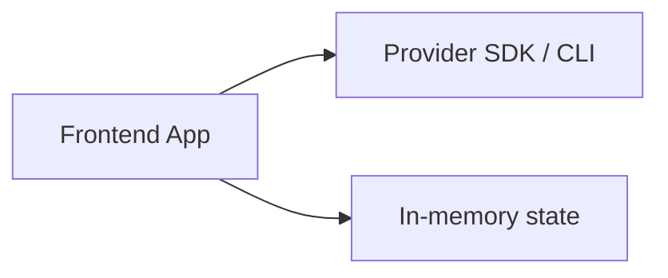
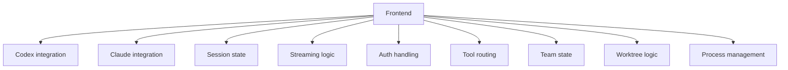
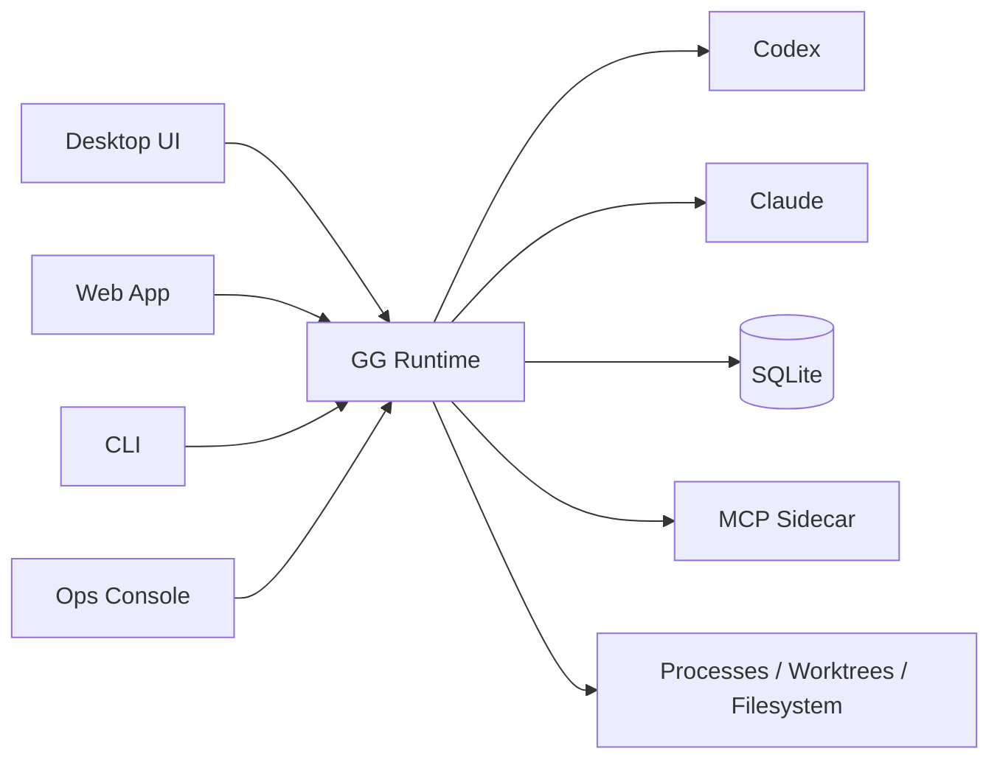
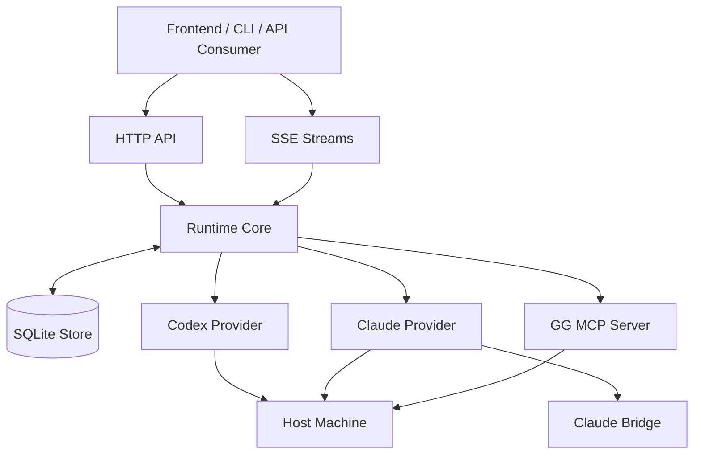
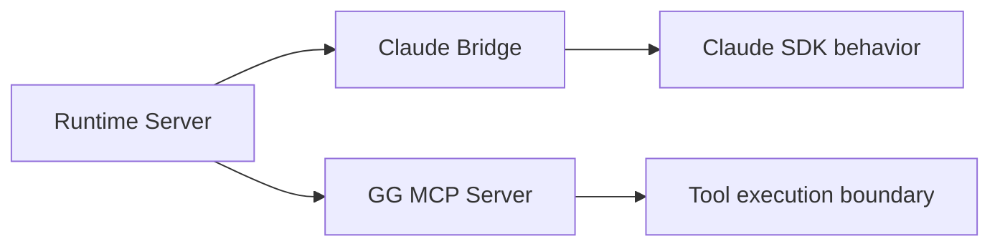
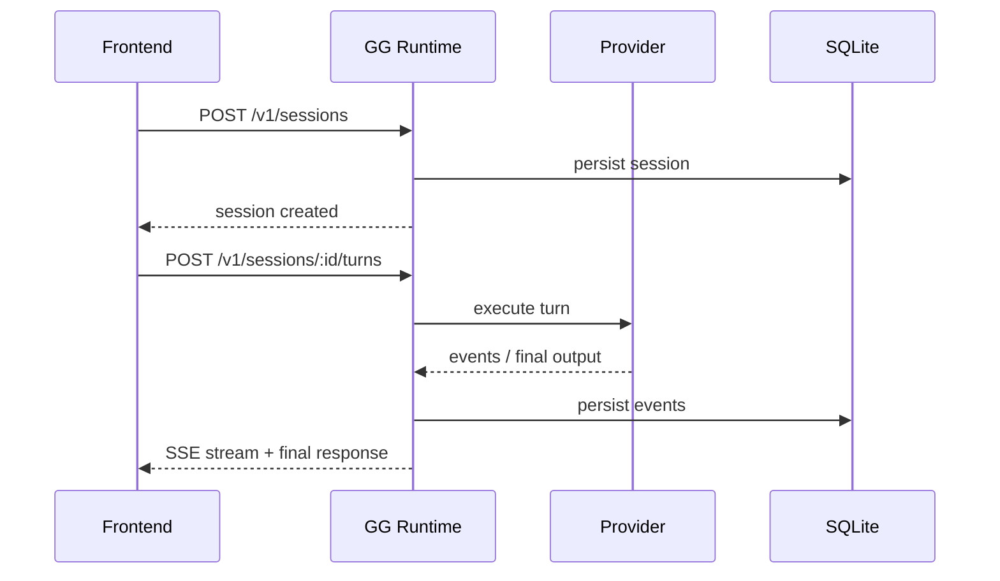

# GG Runtime

GG Runtime is an air traffic control tower for machine agents, not a chat widget with ambition problems.

That line sounds a little rude, but it is also the cleanest way to explain the repo.

Most agent products start with the wrong center of gravity.

They start in the UI.

You wire a provider into a frontend, stream a few tokens, add a tool or two, and it feels like progress.

For a while, it is.

Most agent products start the same way:

- wire a model provider into a frontend
- stream some tokens
- add a few tools
- bolt on persistence later

That works right up until you want the agent to stop being a demo and start being a system.

The moment an agent has to do real work on a real machine, the problem changes completely.

Now you are not building "chat."

You are building a runtime.

You do not just need "chat with tools." You need:

- durable sessions
- reconnectable event streams
- machine-local auth
- processes that outlive a browser tab
- worktrees and filesystem actions
- team communication
- provider-specific quirks hidden behind one contract

Most agent stacks start as frontend demos and accidentally become distributed systems.

GG Runtime skips the accident.

That is the moment this project becomes relevant.

`gg-runtime-server` exists for that moment.

It is a standalone runtime you can deploy on a laptop, a VPS, or a dedicated machine, then drive from any frontend over HTTP and SSE.

Instead of burying agent behavior inside your UI, you move the hard part into a machine-side runtime that can persist, recover, stream, and keep working even when the client disappears.

The browser tab is now a remote control, not the engine block.

## The Story

The project exists because frontend-first agent architectures usually collapse under their own success.

They do not fail because they were foolish. They fail because they actually started to matter.

At first, everything feels simple:



Then you need more:

- a second provider
- resumable sessions
- background execution
- real filesystem work
- team messaging
- process management
- durable history
- a second client

Now the app looks more like this:



That architecture is fragile. Every new product surface ends up rebuilding the same runtime concerns.

It is the software equivalent of taping a second steering wheel onto the passenger seat and calling it multi-driver support.

This repo takes the opposite approach:



The runtime becomes the durable backend product. The UI becomes a client.

That is the whole bet.

And it is a strong bet, because the runtime is where the complexity was going to end up anyway.

## Why This Project Is Interesting

The cool part is not just that it talks to Codex and Claude.

The cool part is that it treats agent execution as infrastructure:

- providers are adapters, not app architecture
- events are durable and replayable
- long-running work belongs to the runtime, not the browser tab
- machine operations are first-class
- frontend apps can stay thin

In practice, that means you can build a serious agent system once at the runtime layer, then expose it through multiple products without rewriting the hard parts.

That is the difference between:

- "our app has an agent feature"
- and "we have an agent platform we can keep building on"

Provider APIs change. Runtime contracts should not.

## What The Runtime Actually Owns

`gg-runtime-server` is the control plane for agent work on a machine.

It owns:

- provider-backed sessions
- turn execution
- persistent event history
- SSE fanout
- auth staging and provider readiness
- process execution
- team messaging and deliveries
- worktree allocation and lifecycle
- MCP tool plumbing

The UI does not need to know how Codex auth is staged, how Claude is bridged, how provider quirks are normalized, or how a worktree is claimed. It just speaks HTTP and SSE.

That boundary is what makes the architecture reusable.

If your agents can mutate repos and spawn processes, the machine is the product boundary. This repo just stops pretending otherwise.

## Mental Model

Think of the system like this:



The important boundary is between the client and the runtime, not between the client and the model provider.

That sounds subtle, but it changes everything. Once that boundary is real, your frontend stops owning orchestration logic it was never meant to carry.

Different engine rooms, same cockpit instruments.

## What You Get

### One runtime model across providers

Today the runtime supports:

- Codex
- Claude

Those providers are normalized into one shared model for:

- sessions
- turns
- streamed events
- approvals
- terminal assistant output
- recovery and replay

That matters because frontends should not have to learn different lifecycle semantics per provider.

The provider layer should be replaceable. The runtime contract should be stable.

Codex and Claude are different dialects. The runtime is the interpreter with a durable transcript.

### Durable, replayable sessions

Events are stored in SQLite and streamed over SSE.

That gives you:

- reconnectable UIs
- replayable session history
- better debugging
- less frontend guesswork
- a backend that can keep running while clients disconnect and reconnect

### Real machine-side execution

This runtime is built for agents that actually operate on a machine, including:

- filesystem work
- provider session execution
- MCP tool calls
- process management
- worktree operations
- team-style coordination flows

It is much closer to a control plane than a chatbot server.

That is the right mental category for this repo.

Or, if you prefer the less polite version: it is Kubernetes for agent turns, but with receipts.

The receipts matter. SQLite stores the event log, scoped sequencing, delivery states, and recovery metadata, which means the runtime can explain what happened instead of shrugging in JSON.

The browser reconnects. The runtime remembers.

### A real native multi-agent layer

This is one of the most interesting parts of the repo.

The runtime does not just let one user talk to one model. It has a native agent layer where agents can:

- message other agents
- supervise other agents
- interrupt or defer messages based on policy
- spawn teammates
- claim worktrees
- coordinate live work across one shared runtime

And it does that without caring whether a given agent is running on Codex or Claude.

That is a bigger deal than it sounds.

Most systems treat agent collaboration like theater. A bunch of personas, some prompts, and good luck.

This repo treats it like transport infrastructure.

Agent-to-agent messaging is modeled like delivery infrastructure:

- policy
- queueing
- retries
- cancellation
- replay
- audit events

So the system is not just "agents talking." It is agents talking with timing rules, interruption rules, delivery states, deferred injection, and receipts.

That is how you turn multi-agent behavior from roleplay into operations.

### A deployable product boundary

The runtime ships as one bundle:

- `bin/gg-runtime-server`
- `sidecars/claude-bridge/claude-bridge`
- `sidecars/gg-mcp-server/gg-mcp-server`

That bundle is the backend product. Your UI is not where the business logic has to live anymore.

If you are building multiple agent applications, or even one serious one, that separation pays for itself fast.

Your frontend is Slack. This runtime is the message bus plus scheduler plus incident log.

## Architecture

Repository shape:

- `crates/runtime-server`: HTTP/SSE server and bootstrap layer
- `crates/runtime-core`: runtime state machine, orchestration, events, teams
- `crates/runtime-store-sqlite`: durable state and event storage
- `crates/runtime-provider-codex`: Codex adapter
- `crates/runtime-provider-claude`: Claude adapter
- `crates/runtime-tools`: shared runtime tooling/process support
- `sidecars/claude-bridge`: Claude bridge process
- `sidecars/gg-mcp-server`: MCP sidecar process

Why sidecars exist:



They keep unstable or provider-specific behavior isolated behind stable process boundaries.

That is boring in exactly the right way.

You want the provider weirdness and MCP weirdness in boxes with labels, not leaking into the whole runtime like a kitchen sink backing up into the living room.

## Quick Start

### Install the release bundle

```bash
./scripts/install-runtime.sh latest
```

Or directly from GitHub:

```bash
curl -fsSL https://raw.githubusercontent.com/amxv/gg-agent-runtime/main/scripts/install-runtime.sh | \
  bash -s -- latest
```

Only set `GG_RUNTIME_REPO` if you intentionally want a fork:

```bash
GG_RUNTIME_REPO=owner/repo ./scripts/install-runtime.sh latest
```

### Login providers on the machine

```bash
codex login
claude login
```

### Start the runtime

```bash
export PATH="$HOME/.local/bin:$PATH"
cp "$HOME/.local/runtime-server.toml.example" ./runtime-server.toml
gg-runtime-server --check-config --config ./runtime-server.toml
gg-runtime-server --config ./runtime-server.toml
```

That is the default path. Change config only when you need different bind addresses, auth settings, or data locations.

### VPS always-on path (recommended for Linux host deploys)

```bash
./scripts/upgrade-runtime.sh latest
cp "$HOME/.local/share/gg-runtime/current/runtime-server.toml.example" "$HOME/.config/gg-runtime/runtime-server.toml"
./scripts/preflight-runtime.sh --config "$HOME/.config/gg-runtime/runtime-server.toml" --runtime-bin "$HOME/.local/share/gg-runtime/current/bin/gg-runtime-server"
```

Then install the systemd user unit from:

- `~/.local/share/gg-runtime/current/deploy/systemd/gg-runtime.service.example`
- `~/.local/share/gg-runtime/current/deploy/systemd/gg-runtime.env.example`

## What A Frontend Talks To

The runtime exposes:

- JSON HTTP endpoints for lifecycle actions
- SSE streams for live event delivery
- OpenAPI for the route surface

Important routes:

- `GET /health`
- `GET /openapi.yaml`
- `GET /v1/openapi.yaml`
- `/v1/providers/*`
- `/v1/sessions/*`
- `/v1/events/stream`
- `/v1/teams/*`
- `/v1/processes/*`
- `/v1/worktrees/*`
- `/v1/mcp/*`

Simple shape:



This is the design goal in one sentence: your application should talk to a runtime service, not directly to provider CLIs.

That keeps your frontend simpler, your backend more honest, and your system much easier to evolve.

Team orchestration is already a first-class runtime API here. The MCP-facing team/tool surface is still evolving toward full parity, and it is worth being honest about that. The right story is not "everything is magically unified already." The right story is "the runtime contract is real, and the remaining surface area is being pulled into it on purpose."

## Auth Model

- Codex: machine login via `codex login`, with staged runtime auth support from `~/.gg/codex/auth.json`
- Claude default: `host_machine`, which uses machine login material
- Claude optional: `runtime_managed`, which lets the runtime own imported auth/config files

## OpenAPI

- public route: `GET /openapi.yaml`
- auth route: `GET /v1/openapi.yaml`
- repo artifact: [`openapi/runtime-server-openapi.yaml`](openapi/runtime-server-openapi.yaml)

Regenerate it with:

```bash
cargo run -p runtime-server --bin gg-runtime-server -- --write-openapi
```

The OpenAPI file is generated from maintained source parsing in
[`crates/runtime-server/src/openapi.rs`](crates/runtime-server/src/openapi.rs),
not from runtime route introspection. That is a deliberate tradeoff and is documented honestly.

## Source Install

If you want to build from source instead of downloading a release bundle:

```bash
./scripts/install-from-source.sh
```

## Release Pipeline

The repo includes a GitHub Actions release workflow:

- [`.github/workflows/release.yml`](.github/workflows/release.yml)

It builds release bundles for:

- Linux x86_64
- macOS arm64
- macOS x86_64

and publishes `gg-runtime-<platform>-<arch>.tar.gz` assets on `v*` tags.

## Docs

- Install: [docs/INSTALL.md](docs/INSTALL.md)
- Deployment: [docs/DEPLOYMENT.md](docs/DEPLOYMENT.md)
- API: [docs/API.md](docs/API.md)
- Architecture: [docs/ARCHITECTURE.md](docs/ARCHITECTURE.md)
- Config template: [examples/runtime-server.toml](examples/runtime-server.toml)

## Status

This repo is already beyond the "prototype with ambition" stage.

It includes:

- provider-backed sessions
- durable event replay
- team/comms flows
- worktree lifecycle support
- MCP sidecar support
- real Codex and Claude validation
- release packaging
- deploy docs
- generated OpenAPI

The obvious next step is not "make another backend." The obvious next step is to build better clients on top of this one.

If this project works, it should make future agent applications feel lighter, because the heavy machinery already lives here.

That is the real appeal of the project.

Not "look, it streams tokens."

More like: "look, the architecture finally stopped lying."
