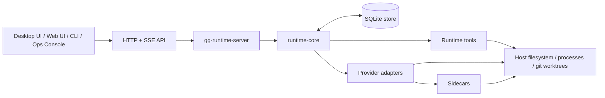
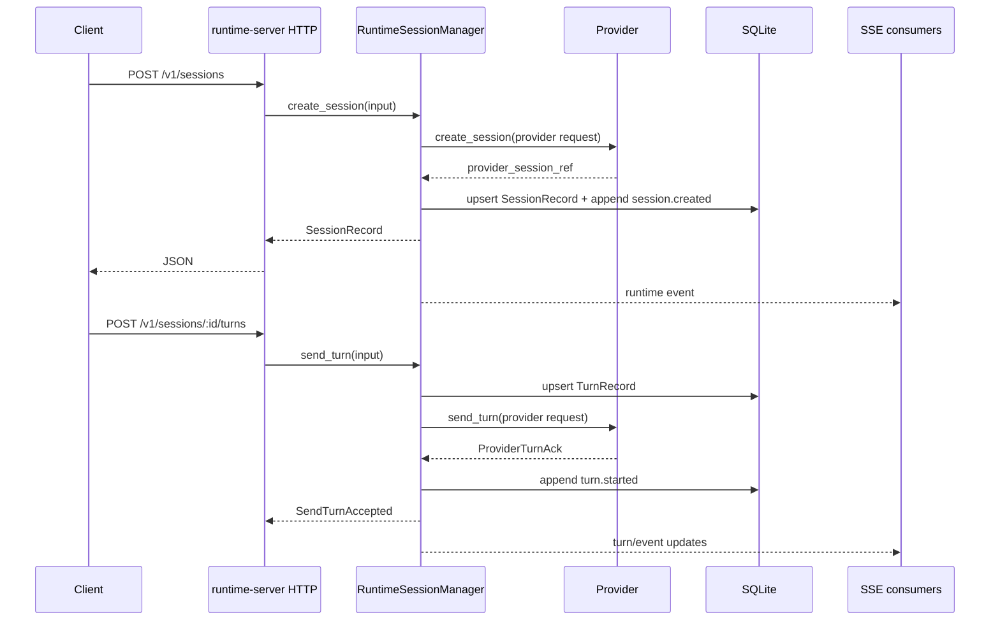
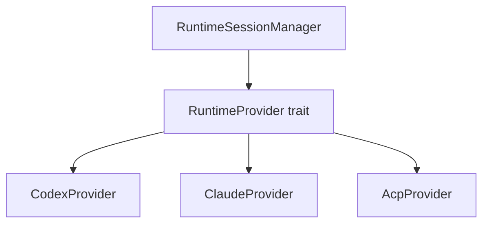

# Architecture

Gooselake is a host-side control plane for machine agents. The core architectural decision is that clients talk to the runtime, not directly to provider CLIs or provider SDKs.



The frontend is a remote control. The runtime is the engine room.

## Composition root

`crates/runtime-server/src/bootstrap.rs` wires the runtime together:

1. load config and ensure data directories
2. bootstrap bearer auth
3. initialize SQLite store
4. create Codex, Claude, and ACP provider adapters based on config
5. stage Codex auth if host auth exists
6. build Claude bridge/MCP sidecar configuration
7. register enabled providers
8. hydrate runtime state and run startup recovery
9. create process manager, team comms, worktree service, and tool gateway
10. expose everything through `RuntimeApp` and Axum routes

The result is a single `BootstrappedRuntime` containing the app, session manager, auth token, bind address, public base URL, and startup recovery summary.

## Crate responsibilities

| Crate | Responsibility |
| --- | --- |
| `runtime-core` | Provider trait, provider registry, runtime session manager, event model, shared records, service traits, team comms implementation. |
| `runtime-server` | Config, bootstrap, HTTP/SSE routes, auth middleware, diagnostics, OpenAPI generation, binary CLI. |
| `runtime-store-sqlite` | Durable state implementation. |
| `runtime-provider-codex` | Codex adapter, model catalog, auth status, session/turn execution. |
| `runtime-provider-claude` | Claude adapter, bridge lifecycle, auth import/status, model catalog, GG MCP injection. |
| `runtime-provider-acp` | ACP stdio adapter, agent-managed auth status, session/turn mapping. |
| `runtime-tools` | Process manager, MCP tool gateway, worktree service, team member spawn workflow. |

## Runtime data model

Durable runtime records include:

- `SessionRecord`
- `TurnRecord`
- `ApprovalRecord`
- `RuntimeEventRecord`
- `TeamRecord`
- `TeamMemberRecord`
- `TeamMessageRecord`
- `TeamDeliveryRecord`
- `ManagedWorktreeRecord`
- `ManagedWorktreeClaimRecord`
- `ProcessRecord`
- `TeamOperationJournalRecord`
- `TeamOperationDiagnosticRecord`
- `CredentialRecord`

The runtime keeps provider-native references, but client-facing identity is runtime-owned. For example, `SessionRecord.id` is the API identity, while `provider_session_ref` and `canonical_provider_session_ref` are adapter details.

## Session lifecycle



Terminal turn state is applied centrally. Providers report `completed`, `failed`, or `interrupted`; the runtime updates turn/session records and emits durable events.

## Event model

Events are persisted as `RuntimeEventRecord` and scoped to one of:

- `session`
- `team`
- `process`
- `worktree`
- `system`

Each event has:

- global row ID
- scoped sequence number
- event kind
- criticality (`critical` or `droppable`)
- payload
- optional provider/provider sequence
- optional session/team/turn references

SSE streams are replay-first. Stream handlers subscribe before replay handoff for session/process streams to reduce lost events during reconnect windows.

Cursor behavior:

- `after_seq` query param takes precedence.
- otherwise `Last-Event-ID` is used when present.
- invalid `Last-Event-ID` returns `400`.
- replay page limits clamp to protect the server.
- keepalive pings are sent every 10 seconds.

## Startup recovery

Startup recovery is intentionally part of the runtime, not an operator script.

At boot, the session manager hydrates SQLite state and reconciles:

- sessions that were active before restart
- active turns
- waiting approvals
- provider resume status
- stale active turn pointers
- deferred team deliveries
- previously running process records

Provider health is recorded in the recovery summary. Sessions can be marked failed when provider resume fails or when required provider refs are missing. This is better than silently presenting stale active work to clients.

## Providers

Providers are adapters behind one contract.



The runtime currently supports:

- Codex: host-machine CLI/auth, staged provider home, Codex model catalog.
- Claude: bridge sidecar, host or runtime-managed auth, Claude model catalog, GG MCP injection.
- ACP: configured external stdio agent, agent-managed auth, session-scoped model behavior.

Provider-specific differences should stay inside provider crates unless they are intentional runtime contract changes.

## Team communication

Team comms turn multi-agent coordination into runtime state rather than prompt theater.

Core concepts:

- teams have a lead agent and members
- messages can be direct or broadcast
- deliveries are explicit records
- delivery policy controls interruption/defer behavior
- messages can be retried or cancelled
- snapshots combine team, messages, delivery map, and cursors
- team events are replayable and streamable

This makes coordination auditable. Clients can render the state without inventing hidden delivery rules.

## Worktrees

The worktree service manages git worktree lifecycle for sessions and spawned teammates.

It records:

- source repo root
- managed worktree root/path
- branch name
- worktree name
- unified workspace path
- deletion policy
- claims by session

Claims are separate from creation. Cleanup respects active claims and deletion policy. Team member removal performs best-effort worktree release/cleanup while preserving the membership removal outcome.

## Processes

The process manager provides runtime-owned background process execution:

- command string execution
- optional cwd and timeout
- concurrency limiting
- stdout/stderr log files
- sampled output events
- authoritative log reads
- process status and kill APIs
- startup recovery that marks pre-restart running records failed

Process tools exposed through MCP still call this same runtime process manager, so host process work remains durable and inspectable.

## Sidecars

Sidecars are integration boundaries, not separate sources of truth.

- Claude bridge isolates Claude SDK/CLI behavior from the Rust server.
- GG MCP server exposes tools to providers, then calls back into the runtime gateway.
- ACP does not ship a runtime-owned sidecar; the configured ACP command is launched directly over stdio.

For details, see [MCP and Sidecars](./MCP_AND_SIDECARS.md).

## API server

`crates/runtime-server/src/http.rs` exposes:

- public health/OpenAPI routes
- protected `/v1` routes
- bearer auth middleware
- provider/model/auth endpoints
- sessions, turns, approvals
- global/session/team/process event replay and streams
- teams and deliveries
- processes and logs
- worktrees
- diagnostics
- MCP gateway

OpenAPI is generated by source parsing in `crates/runtime-server/src/openapi.rs`. It is reliable for route/method/content-type coverage but intentionally broad for many JSON object schemas.

## Deployment boundary

The deployable product boundary is the release bundle plus durable state root:

```text
release bundle, replaceable:
  bin/gg-runtime-server
  sidecars/claude-bridge/claude-bridge
  sidecars/gg-mcp-server/gg-mcp-server
  deploy/systemd/*

durable state, not replaceable:
  runtime-server.toml
  runtime.env
  data.root_dir
  generated token file or configured token secret
```

That split enables staged upgrades and rollback without moving SQLite state, logs, provider directories, or managed worktrees.
