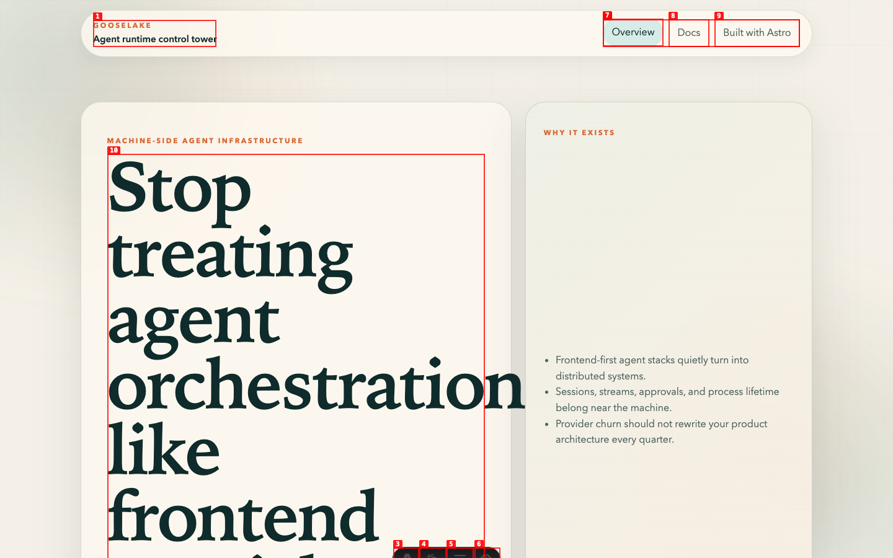
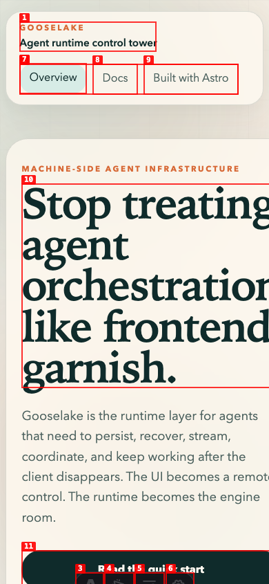
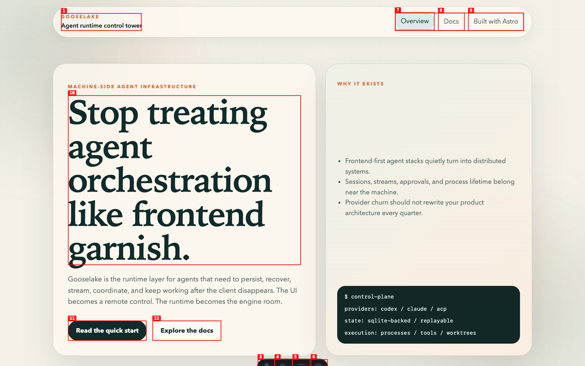
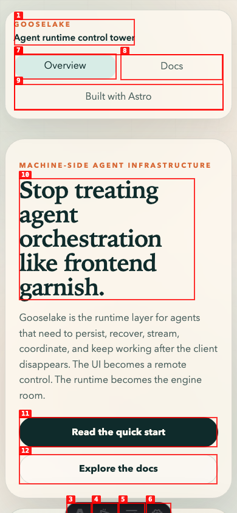
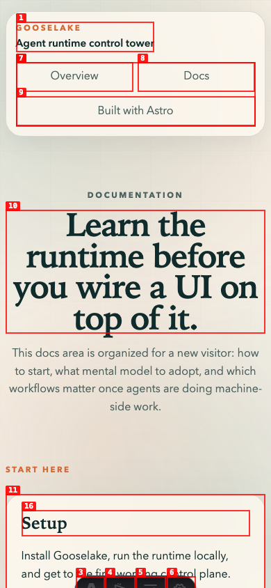

# Dogfood Report: Gooselake Site

| Field | Value |
|-------|-------|
| **Date** | 2026-06-29 |
| **App URL** | http://127.0.0.1:4321 |
| **Session** | gooselake-hero-3 |
| **Scope** | Headless UX pass focused on first-screen readability, layout balance, navigation clarity, docs usability, responsive behavior, and visual polish. |

## Summary

| Severity | Count |
|----------|-------|
| Critical | 0 |
| High | 0 |
| Medium | 1 |
| Low | 1 |
| **Total** | **2** |

## Issues

### ISSUE-001: Homepage hero heading overwhelms and overflows the first screen

| Field | Value |
|-------|-------|
| **Severity** | medium |
| **Category** | visual / ux |
| **URL** | http://127.0.0.1:4321/ |
| **Repro Video** | N/A |

**Description**

The homepage H1 was scaled so large that it dominated the first viewport, overflowed toward the adjacent panel at desktop width, and pushed the primary calls to action toward or below the fold. On mobile, the same scale caused the heading to clip horizontally. The expected behavior is a strong editorial hero that remains readable, contained, and balanced with the supporting panel and CTAs.

**Repro Steps**

1. Navigate to the homepage at 1440x900.
   

2. Resize to 390x844.
   

3. **Observe:** The hero heading overpowers the page and clips at small widths.

**Fix Verification**

The fixed desktop and mobile states keep the H1 contained, preserve the visual direction, and keep the CTAs visible and usable.

---

### ISSUE-002: Mobile header navigation crowds the top of the page

| Field | Value |
|-------|-------|
| **Severity** | low |
| **Category** | ux / visual |
| **URL** | http://127.0.0.1:4321/ |
| **Repro Video** | N/A |

**Description**

At mobile width, the header kept all three navigation links in a single cramped row inside the sticky header pill. The "Built with Astro" link consumed too much horizontal space and made the first screen feel squeezed before the visitor reached the hero. The expected behavior is a compact but readable mobile navigation layout.

**Repro Steps**

1. Navigate to the homepage at 390x844.
   

2. **Observe:** The primary nav is crowded into the header and competes with the hero for space.

**Fix Verification**

The fixed mobile header lays the links into a two-column grid with the longer external link on its own row. The same layout also holds up on the docs index.

---
