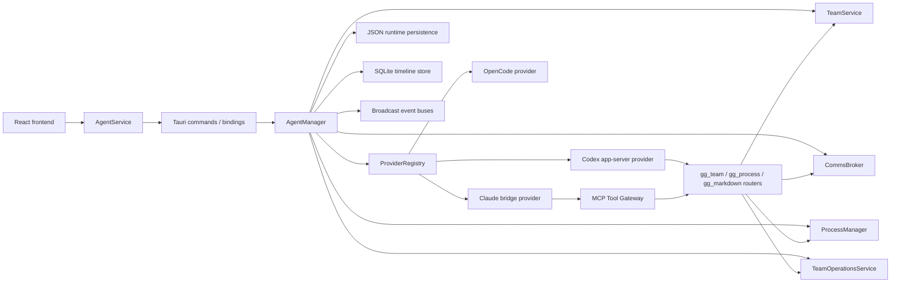
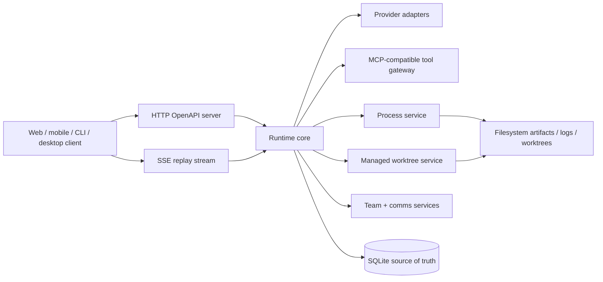
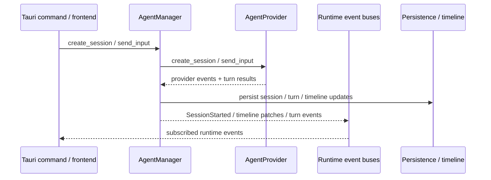
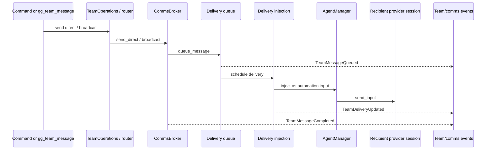
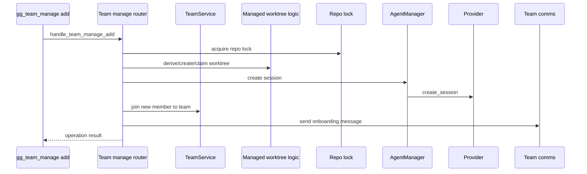

# Standalone Agent Runtime Research Report

Date: 2026-05-05

Scope:
- Read `gg/design-doc-standalone.md` in full.
- Read `tmp/gg-desktop/README.md` in full.
- Inspected the current code under `tmp/gg-desktop/` to map the existing runtime architecture and identify likely extraction seams for a standalone hosted runtime service.

## Executive Summary

The most important finding is structural, not behavioral: this repository does not yet contain an extracted standalone runtime implementation. The only implementation baseline is the desktop/Tauri runtime inside `tmp/gg-desktop/src-tauri/src/agent_runtime/`, while `gg/design-doc-standalone.md` describes the intended target architecture for a single-user hosted runtime with HTTP/OpenAPI, SSE, SQLite, team/comms, process execution, and managed worktrees (`gg/design-doc-standalone.md:5`, `gg/design-doc-standalone.md:15`, `gg/design-doc-standalone.md:21`, `gg/design-doc-standalone.md:41`, `gg/design-doc-standalone.md:81`, `gg/design-doc-standalone.md:82`).

That means the upcoming work is not primarily "refactor existing standalone code." It is "extract and re-host the desktop runtime backend behind a server/API surface." The good news is that the desktop runtime is already organized around seams that match the design doc unusually well:
- `AgentManager` is already the orchestration center for sessions, turns, provider I/O, event fan-out, and persistence-adjacent coordination (`tmp/gg-desktop/src-tauri/src/agent_runtime/manager/mod.rs:780`).
- The provider boundary is already explicit through `AgentProvider` and `ProviderRegistry` (`tmp/gg-desktop/src-tauri/src/agent_runtime/providers/mod.rs:351`, `tmp/gg-desktop/src-tauri/src/agent_runtime/providers/registry.rs:10`).
- Team state, messaging, teammate spawn orchestration, process tools, MCP routing, and managed worktree logic already exist as backend subsystems rather than UI code (`tmp/gg-desktop/src-tauri/src/agent_runtime/team/service.rs:117`, `tmp/gg-desktop/src-tauri/src/agent_runtime/comms/mod.rs:135`, `tmp/gg-desktop/src-tauri/src/agent_runtime/gg_team_tools/router/manage.rs:177`, `tmp/gg-desktop/src-tauri/src/agent_runtime/process_manager/mod.rs:127`, `tmp/gg-desktop/src-tauri/src/agent_runtime/mcp_tool_gateway/mod.rs:21`, `tmp/gg-desktop/src-tauri/src/agent_runtime/managed_worktrees.rs:35`).

The main extraction work is therefore:
1. Replace the Tauri command surface with HTTP/OpenAPI.
2. Replace desktop event subscription patterns with durable SSE/replay APIs.
3. Consolidate persistence around the standalone runtime data model, likely with SQLite as the source of truth as proposed in the design doc (`gg/design-doc-standalone.md:3187`, `gg/design-doc-standalone.md:3220`, `gg/design-doc-standalone.md:3382`).
4. Keep UI-specific timeline projection and store reducers internal to clients, not the runtime API.

## Current State of the Repo

There is no server/runtime crate in this repo yet. A shallow file inventory showed only:
- `gg/design-doc-standalone.md`
- `tmp/gg-desktop/README.md`
- `tmp/gg-desktop/...` source tree

So the design doc is a forward plan, not a description of code already present in the standalone repo.

This matters because file impact falls into two categories:
- Extract/reuse from `tmp/gg-desktop/src-tauri/src/agent_runtime/...`
- Build new standalone server/API/persistence layers that do not yet exist here

## Design Doc Intent vs Current Desktop Architecture

The design doc defines a single-user hosted runtime with:
- a stable HTTP/OpenAPI surface (`gg/design-doc-standalone.md:15`, `gg/design-doc-standalone.md:1578`, `gg/design-doc-standalone.md:1701`)
- SSE as the authoritative replayable realtime stream (`gg/design-doc-standalone.md:82`, `gg/design-doc-standalone.md:1579`, `gg/design-doc-standalone.md:1582`)
- provider adapters preserved behind an internal boundary (`gg/design-doc-standalone.md:36`, `gg/design-doc-standalone.md:197`)
- built-in team/comms, processes, and managed worktrees from MVP day one (`gg/design-doc-standalone.md:41`, `gg/design-doc-standalone.md:3841`, `gg/design-doc-standalone.md:3859`, `gg/design-doc-standalone.md:3872`)

The desktop runtime already contains rough equivalents for nearly all of those subsystems, but they are exposed through:
- Tauri commands (`tmp/gg-desktop/src-tauri/src/bindings.rs:11`, `tmp/gg-desktop/src-tauri/src/bindings.rs:68`)
- in-process broadcast channels (`tmp/gg-desktop/src-tauri/src/agent_runtime/manager/runtime_ops/construction.rs:273`)
- frontend-specific event coercion and recovery code (`tmp/gg-desktop/src/services/agent-service/runtime-events.ts:328`, `tmp/gg-desktop/src/store/team-comms-store.ts:696`)

So the target shape is aligned, but the transport and persistence contracts still need to be extracted and hardened.

## Architecture Map

### 1. Current desktop runtime architecture

### 2. Standalone extraction target

### 3. Reuse assessment

The current desktop runtime already has good extraction seams:

| Area | Current baseline | Extraction assessment |
| --- | --- | --- |
| Session/turn orchestration | `agent_runtime/manager/*` | Strong candidate for reuse with transport/persistence changes |
| Provider abstraction | `providers/mod.rs`, `providers/registry.rs` | Strong candidate for reuse |
| Team state | `team/service.rs` | Strong candidate for reuse |
| Team messaging/delivery | `comms/*` | Strong candidate for reuse, but durable eventing needs work |
| Team spawn/worktree orchestration | `gg_team_tools/router/manage.rs`, `team_operations/*` | Reusable logic, but needs server-facing API and recovery hardening |
| Process execution | `process_manager/*`, `gg_process_tools/*` | Strong candidate for reuse |
| MCP gateway | `mcp_tool_gateway/*` | Strong candidate for reuse |
| Persistence | `persistence/mod.rs`, `timeline_store/*` | Conceptually reusable, but likely needs redesign around SQLite-first truth |
| Frontend event/state reducers | `src/store/*`, `src/services/*` | Desktop/client-only; should not move into runtime core |
| Tauri commands | `src-tauri/src/commands/agents/mod.rs`, `bindings.rs` | Replace with HTTP/OpenAPI |

## Core Runtime Subsystems in Desktop Today

### Agent manager and runtime session control

`AgentManager` is the central integration point (`tmp/gg-desktop/src-tauri/src/agent_runtime/manager/mod.rs:780`). It owns or coordinates:
- session orchestration
- provider resolution
- event buses
- timeline projection state
- optional timeline store

Construction code shows the current eventing model clearly:
- provider event queue via `mpsc::channel(...)` (`tmp/gg-desktop/src-tauri/src/agent_runtime/manager/runtime_ops/construction.rs:264`)
- multiple broadcast buses for runtime events (`tmp/gg-desktop/src-tauri/src/agent_runtime/manager/runtime_ops/construction.rs:273`)
- in-memory timeline projection state (`tmp/gg-desktop/src-tauri/src/agent_runtime/manager/runtime_ops/construction.rs:567`)
- a provider event sink exported from the manager (`tmp/gg-desktop/src-tauri/src/agent_runtime/manager/runtime_ops/construction.rs:585`)

Session and turn APIs are already explicit:
- create session (`tmp/gg-desktop/src-tauri/src/agent_runtime/manager/session_api/session_lifecycle.rs:12`)
- resume session (`tmp/gg-desktop/src-tauri/src/agent_runtime/manager/session_api/session_lifecycle.rs:200`)
- close session (`tmp/gg-desktop/src-tauri/src/agent_runtime/manager/session_api/session_lifecycle.rs:262`)
- send input (`tmp/gg-desktop/src-tauri/src/agent_runtime/manager/session_api/turn_management.rs:1105`)
- send input v2 (`tmp/gg-desktop/src-tauri/src/agent_runtime/manager/session_api/turn_management.rs:1275`)
- interrupt turn (`tmp/gg-desktop/src-tauri/src/agent_runtime/manager/session_api/turn_management.rs:1902`)
- approval response (`tmp/gg-desktop/src-tauri/src/agent_runtime/manager/session_api/turn_management.rs:2049`)
- wait for turn (`tmp/gg-desktop/src-tauri/src/agent_runtime/manager/session_api/turn_management.rs:2062`)

`RuntimeSession` then enforces lifecycle/state-machine invariants around normalized sessions (`tmp/gg-desktop/src-tauri/src/agent_runtime/session.rs:21`, `tmp/gg-desktop/src-tauri/src/agent_runtime/session.rs:138`).

Assessment:
- This is already close to the proposed runtime core in the design doc.
- The biggest change is not logic ownership; it is exposing the manager through server routes and durable replayable event streams instead of Tauri commands plus local broadcast.

### Provider boundary

The provider abstraction is already one of the cleanest parts of the codebase.

`AgentProvider` defines the runtime-provider contract:
- `create_session` (`tmp/gg-desktop/src-tauri/src/agent_runtime/providers/mod.rs:355`)
- `resume_session` (`tmp/gg-desktop/src-tauri/src/agent_runtime/providers/mod.rs:361`)
- `send_input` (`tmp/gg-desktop/src-tauri/src/agent_runtime/providers/mod.rs:367`)
- `interrupt_turn` (`tmp/gg-desktop/src-tauri/src/agent_runtime/providers/mod.rs:369`)
- `respond_approval` (`tmp/gg-desktop/src-tauri/src/agent_runtime/providers/mod.rs:371`)
- `wait_for_turn` (`tmp/gg-desktop/src-tauri/src/agent_runtime/providers/mod.rs:375`)
- `hard_fork_session` (`tmp/gg-desktop/src-tauri/src/agent_runtime/providers/mod.rs:384`)
- `list_models` (`tmp/gg-desktop/src-tauri/src/agent_runtime/providers/mod.rs:414`)

`ProviderRegistry` already resolves implementations by provider kind (`tmp/gg-desktop/src-tauri/src/agent_runtime/providers/registry.rs:10`, `tmp/gg-desktop/src-tauri/src/agent_runtime/providers/registry.rs:24`, `tmp/gg-desktop/src-tauri/src/agent_runtime/providers/registry.rs:42`).

That matches the design doc's instruction to preserve the provider abstraction (`gg/design-doc-standalone.md:197`).

Assessment:
- This should be retained almost directly in a standalone runtime.
- The main work is lifecycle/config extraction and server boot wiring.

### Codex provider

The Codex provider is already structured like a reusable server-side adapter:
- provider implementation entrypoint: `tmp/gg-desktop/src-tauri/src/agent_runtime/providers/codex_app_server/agent_provider_impl.rs:4`
- session creation: `tmp/gg-desktop/src-tauri/src/agent_runtime/providers/codex_app_server/agent_provider_impl.rs:21`
- runtime dynamic tool injection during `thread/start`: `tmp/gg-desktop/src-tauri/src/agent_runtime/providers/codex_app_server/agent_provider_impl.rs:130`, `tmp/gg-desktop/src-tauri/src/agent_runtime/providers/codex_app_server/agent_provider_impl.rs:139`
- emits `SessionStarted`: `tmp/gg-desktop/src-tauri/src/agent_runtime/providers/codex_app_server/agent_provider_impl.rs:192`
- resume path: `tmp/gg-desktop/src-tauri/src/agent_runtime/providers/codex_app_server/agent_provider_impl.rs:211`

The provider owns shared tool router wiring and session concurrency caps (`tmp/gg-desktop/src-tauri/src/agent_runtime/providers/codex_app_server/mod.rs:51`, `tmp/gg-desktop/src-tauri/src/agent_runtime/providers/codex_app_server/mod.rs:127`).

Assessment:
- Strong extraction candidate.
- Main risk is preserving tool/router configuration and process ownership semantics when moving out of the desktop app lifecycle.

### Claude provider

The Claude provider is more coupled to local sidecar management, but still clearly adapter-shaped:
- Bun sidecar bridge and line-delimited JSON protocol are described at the top of the module (`tmp/gg-desktop/src-tauri/src/agent_runtime/providers/claude_code/mod.rs:1`, `tmp/gg-desktop/src-tauri/src/agent_runtime/providers/claude_code/mod.rs:3`)
- bridge pool/session allocation fields live in the provider state (`tmp/gg-desktop/src-tauri/src/agent_runtime/providers/claude_code/mod.rs:66`, `tmp/gg-desktop/src-tauri/src/agent_runtime/providers/claude_code/mod.rs:81`)
- provider implementation entrypoint: `tmp/gg-desktop/src-tauri/src/agent_runtime/providers/claude_code/provider_impl/agent_provider_impl.rs:6`
- session creation: `tmp/gg-desktop/src-tauri/src/agent_runtime/providers/claude_code/provider_impl/agent_provider_impl.rs:23`
- `ggMcpServer` config injection: `tmp/gg-desktop/src-tauri/src/agent_runtime/providers/claude_code/provider_impl/agent_provider_impl.rs:69`
- provider session refs / canonical refs extracted from the provider response: `tmp/gg-desktop/src-tauri/src/agent_runtime/providers/claude_code/provider_impl/agent_provider_impl.rs:119`, `tmp/gg-desktop/src-tauri/src/agent_runtime/providers/claude_code/provider_impl/agent_provider_impl.rs:124`
- emits `SessionStarted`: `tmp/gg-desktop/src-tauri/src/agent_runtime/providers/claude_code/provider_impl/agent_provider_impl.rs:142`
- resume path: `tmp/gg-desktop/src-tauri/src/agent_runtime/providers/claude_code/provider_impl/agent_provider_impl.rs:161`

`gg_mcp` wiring is an explicit internal boundary:
- decide whether to configure MCP server: `tmp/gg-desktop/src-tauri/src/agent_runtime/providers/claude_code/provider_impl/gg_mcp.rs:20`
- include `providerSessionRef` and `claudeCanonicalSessionRef`: `tmp/gg-desktop/src-tauri/src/agent_runtime/providers/claude_code/provider_impl/gg_mcp.rs:8`
- inject `GG_MCP_CALLER_AGENT_ID`: `tmp/gg-desktop/src-tauri/src/agent_runtime/providers/claude_code/provider_impl/gg_mcp.rs:61`

Assessment:
- Extractable, but this is one of the highest-risk areas because bridge lifecycle, SDK compatibility shims, and MCP bootstrap behavior are operational rather than purely logical concerns.

### Team service

Team state is not UI glue; it is already backend state and policy:
- `TeamService` struct: `tmp/gg-desktop/src-tauri/src/agent_runtime/team/service.rs:117`
- create team: `tmp/gg-desktop/src-tauri/src/agent_runtime/team/service.rs:168`
- delete: `tmp/gg-desktop/src-tauri/src/agent_runtime/team/service.rs:275`
- join: `tmp/gg-desktop/src-tauri/src/agent_runtime/team/service.rs:301`
- set lead: `tmp/gg-desktop/src-tauri/src/agent_runtime/team/service.rs:493`
- remove member: `tmp/gg-desktop/src-tauri/src/agent_runtime/team/service.rs:553`
- interrupt all turns: `tmp/gg-desktop/src-tauri/src/agent_runtime/team/service.rs:781`

This matches the design doc's requirement that team/comms be first-class runtime entities with public APIs and provider-facing tools (`gg/design-doc-standalone.md:41`, `gg/design-doc-standalone.md:1012`).

Assessment:
- Strong extraction candidate.
- Expect HTTP routes for team CRUD and membership operations to wrap this service or a close derivative.

### Team communications and delivery engine

The comms system is one of the strongest indicators that the standalone runtime is an extraction, not a greenfield rewrite.

Key entrypoints:
- `CommsBroker`: `tmp/gg-desktop/src-tauri/src/agent_runtime/comms/mod.rs:135`
- direct send: `tmp/gg-desktop/src-tauri/src/agent_runtime/comms/api_send.rs:4`
- broadcast: `tmp/gg-desktop/src-tauri/src/agent_runtime/comms/api_send.rs:105`
- queue message: `tmp/gg-desktop/src-tauri/src/agent_runtime/comms/api_delivery/queue.rs:4`
- inject delivery: `tmp/gg-desktop/src-tauri/src/agent_runtime/comms/api_delivery/injection.rs:42`
- retry delivery: `tmp/gg-desktop/src-tauri/src/agent_runtime/comms/api_delivery/lifecycle.rs:4`
- cancel message: `tmp/gg-desktop/src-tauri/src/agent_runtime/comms/api_delivery/lifecycle.rs:96`
- transition delivery status: `tmp/gg-desktop/src-tauri/src/agent_runtime/comms/api_delivery/lifecycle.rs:188`

Relevant runtime events already exist:
- `TeamCreated`: `tmp/gg-desktop/src-tauri/src/agent_runtime/events.rs:391`
- `TeamMessageQueued`: `tmp/gg-desktop/src-tauri/src/agent_runtime/events.rs:412`
- `TeamDeliveryUpdated`: `tmp/gg-desktop/src-tauri/src/agent_runtime/events.rs:416`
- `TeamMessageCompleted`: `tmp/gg-desktop/src-tauri/src/agent_runtime/events.rs:424`
- channel routing: `tmp/gg-desktop/src-tauri/src/agent_runtime/events.rs:434`
- droppability policy: `tmp/gg-desktop/src-tauri/src/agent_runtime/events.rs:478`
- team ID hinting: `tmp/gg-desktop/src-tauri/src/agent_runtime/events.rs:488`

Assessment:
- The behavioral model already exists.
- The extraction challenge is making event delivery durable and replayable via SSE, instead of merely publish/subscribe inside one desktop process.

### Team operations and teammate spawning

The current desktop runtime already has a higher-level orchestration layer for team operations:
- `TeamOperationsService`: `tmp/gg-desktop/src-tauri/src/agent_runtime/team_operations/service.rs:31`
- repo lock allocation for native worktrees: `tmp/gg-desktop/src-tauri/src/agent_runtime/team_operations/service.rs:274`
- messaging wrappers from commands/team tools:
  - direct from command: `tmp/gg-desktop/src-tauri/src/agent_runtime/team_operations/messaging.rs:48`
  - direct from team tool: `tmp/gg-desktop/src-tauri/src/agent_runtime/team_operations/messaging.rs:143`
  - broadcast from command: `tmp/gg-desktop/src-tauri/src/agent_runtime/team_operations/messaging.rs:243`
  - broadcast from team tool: `tmp/gg-desktop/src-tauri/src/agent_runtime/team_operations/messaging.rs:335`

This suggests the desktop code already distinguishes:
- low-level team/comms mechanics
- higher-level user or tool initiated team operations

Assessment:
- Good extraction seam for HTTP endpoints and idempotent operation APIs.
- The design doc's emphasis on team operations with durable state and recovery fits this layer well (`gg/design-doc-standalone.md:3713`, `gg/design-doc-standalone.md:3927`, `gg/design-doc-standalone.md:3935`).

### Managed worktrees

Managed worktrees already have explicit state and startup repair helpers:
- `ManagedWorktreeRecord`: `tmp/gg-desktop/src-tauri/src/agent_runtime/managed_worktrees.rs:35`
- `ManagedWorktreeReleaseResult`: `tmp/gg-desktop/src-tauri/src/agent_runtime/managed_worktrees.rs:59`
- hydrate records: `tmp/gg-desktop/src-tauri/src/agent_runtime/managed_worktrees.rs:155`
- prepare startup state: `tmp/gg-desktop/src-tauri/src/agent_runtime/managed_worktrees.rs:255`
- eligible claimant session IDs: `tmp/gg-desktop/src-tauri/src/agent_runtime/managed_worktrees.rs:292`
- prune claims for non-members: `tmp/gg-desktop/src-tauri/src/agent_runtime/managed_worktrees.rs:307`

Teammate spawning with worktree orchestration currently lives in the team tool router:
- `handle_team_manage`: `tmp/gg-desktop/src-tauri/src/agent_runtime/gg_team_tools/router/manage.rs:177`
- `handle_team_manage_add`: `tmp/gg-desktop/src-tauri/src/agent_runtime/gg_team_tools/router/manage.rs:255`
- `orchestrate_spawned_member_add`: `tmp/gg-desktop/src-tauri/src/agent_runtime/gg_team_tools/router/manage.rs:415`

Cleanup is handled separately:
- cleanup entrypoint: `tmp/gg-desktop/src-tauri/src/agent_runtime/team_operations/native_worktree_cleanup.rs:154`
- reference-scan variant: `tmp/gg-desktop/src-tauri/src/agent_runtime/team_operations/native_worktree_cleanup.rs:165`
- `git worktree remove --force` path: `tmp/gg-desktop/src-tauri/src/agent_runtime/team_operations/native_worktree_cleanup.rs:219`

Assessment:
- The core domain model aligns strongly with the design doc's managed worktree model (`gg/design-doc-standalone.md:317`, `gg/design-doc-standalone.md:1000`, `gg/design-doc-standalone.md:1004`, `gg/design-doc-standalone.md:1198`, `gg/design-doc-standalone.md:1683`, `gg/design-doc-standalone.md:3220`, `gg/design-doc-standalone.md:3373`).
- Cleanup still looks more operational and heuristic than the fully authoritative claim model envisioned in the design doc. This is a likely refinement area during extraction.

### Process execution and process tools

The process subsystem is already standalone-service-like:
- process manager config: `tmp/gg-desktop/src-tauri/src/agent_runtime/process_manager/mod.rs:127`
- process result injection tool constant: `tmp/gg-desktop/src-tauri/src/agent_runtime/process_manager/mod.rs:58`
- permission approval ID prefix: `tmp/gg-desktop/src-tauri/src/agent_runtime/process_manager/mod.rs:59`
- runtime tasks start: `tmp/gg-desktop/src-tauri/src/agent_runtime/process_manager/impl_runtime.rs:4`
- lifecycle runner: `tmp/gg-desktop/src-tauri/src/agent_runtime/process_manager/impl_runtime.rs:40`

Tool exposure exists in two places:
- provider-facing process tools via `gg_process_*`
- MCP gateway dispatch to process tools (`tmp/gg-desktop/src-tauri/src/agent_runtime/mcp_tool_gateway/mod.rs:231`)

This matches the design doc almost directly:
- process APIs and tools are core, not optional (`gg/design-doc-standalone.md:278`, `gg/design-doc-standalone.md:290`, `gg/design-doc-standalone.md:3479`, `gg/design-doc-standalone.md:3511`, `gg/design-doc-standalone.md:3859`)

Assessment:
- Strong extraction candidate with limited conceptual change.
- Major work is persistence, streaming, and API surface rather than core behavior.

### MCP-compatible tool gateway

The desktop runtime already has a standalone-looking internal MCP gateway:
- `McpToolGatewayRuntime`: `tmp/gg-desktop/src-tauri/src/agent_runtime/mcp_tool_gateway/mod.rs:21`
- startup: `tmp/gg-desktop/src-tauri/src/agent_runtime/mcp_tool_gateway/mod.rs:62`
- `/invoke` route: `tmp/gg-desktop/src-tauri/src/agent_runtime/mcp_tool_gateway/mod.rs:87`
- dispatch to `gg_team_*`: `tmp/gg-desktop/src-tauri/src/agent_runtime/mcp_tool_gateway/mod.rs:204`
- dispatch to `gg_process_*`: `tmp/gg-desktop/src-tauri/src/agent_runtime/mcp_tool_gateway/mod.rs:231`
- dispatch to `gg_markdown_*`: `tmp/gg-desktop/src-tauri/src/agent_runtime/mcp_tool_gateway/mod.rs:247`

There is also a sidecar `gg-mcp-server` entrypoint at `tmp/gg-desktop/src-tauri/sidecars/gg-mcp-server/src/main.rs`.

Assessment:
- The logical tool boundary already exists and should carry over well.
- The standalone runtime should keep MCP/provider-facing tool invocation internal while also exposing public HTTP APIs for equivalent operations, as the design doc proposes (`gg/design-doc-standalone.md:3448`).

### Persistence and timeline

Current persistence is split:
- JSON-oriented runtime persistence:
  - `AgentRuntimePersistence`: `tmp/gg-desktop/src-tauri/src/agent_runtime/persistence/mod.rs:44`
  - `PersistedRuntimeState`: `tmp/gg-desktop/src-tauri/src/agent_runtime/persistence/mod.rs:59`
  - includes managed worktrees: `tmp/gg-desktop/src-tauri/src/agent_runtime/persistence/mod.rs:67`
  - load state: `tmp/gg-desktop/src-tauri/src/agent_runtime/persistence/mod.rs:260`
  - save teams + managed worktrees: `tmp/gg-desktop/src-tauri/src/agent_runtime/persistence/mod.rs:457`
  - save comms: `tmp/gg-desktop/src-tauri/src/agent_runtime/persistence/mod.rs:481`
- SQLite timeline storage:
  - `TimelineStore`: `tmp/gg-desktop/src-tauri/src/agent_runtime/timeline_store/mod.rs:39`
  - `TimelineSessionState`: `tmp/gg-desktop/src-tauri/src/agent_runtime/timeline_store/mod.rs:53`
  - `TimelineStoredRow`: `tmp/gg-desktop/src-tauri/src/agent_runtime/timeline_store/mod.rs:65`
  - `TimelineHydratedRowsV2`: `tmp/gg-desktop/src-tauri/src/agent_runtime/timeline_store/mod.rs:225`
  - `TimelineStoreMaterializationV2`: `tmp/gg-desktop/src-tauri/src/agent_runtime/timeline_store/mod.rs:233`
  - open/create: `tmp/gg-desktop/src-tauri/src/agent_runtime/timeline_store/mod.rs:257`
  - hydrate rows: `tmp/gg-desktop/src-tauri/src/agent_runtime/timeline_store/mod.rs:385`

Assessment:
- This is the biggest mismatch against the design doc.
- The design doc explicitly wants SQLite as the source of truth, including sessions, events, messages, deliveries, worktrees, processes, and durable replay (`gg/design-doc-standalone.md:181`, `gg/design-doc-standalone.md:3187`, `gg/design-doc-standalone.md:3197`, `gg/design-doc-standalone.md:3220`, `gg/design-doc-standalone.md:3382`, `gg/design-doc-standalone.md:3901`).
- Current desktop persistence is workable for the app, but not ideal as the public runtime contract.

## Data and Event Flows

### 1. Session and turn flow today

Relevant references:
- create session path (`tmp/gg-desktop/src-tauri/src/agent_runtime/manager/session_api/session_lifecycle.rs:12`)
- send input path (`tmp/gg-desktop/src-tauri/src/agent_runtime/manager/session_api/turn_management.rs:1105`)
- provider event sink (`tmp/gg-desktop/src-tauri/src/agent_runtime/manager/runtime_ops/construction.rs:585`)

Standalone implication:
- This same flow can remain, but the client-facing output should become HTTP response plus SSE events instead of Tauri result plus local event listener callbacks.

### 2. Team message flow today

Relevant references:
- direct send (`tmp/gg-desktop/src-tauri/src/agent_runtime/comms/api_send.rs:4`)
- broadcast (`tmp/gg-desktop/src-tauri/src/agent_runtime/comms/api_send.rs:105`)
- queue (`tmp/gg-desktop/src-tauri/src/agent_runtime/comms/api_delivery/queue.rs:4`)
- injection (`tmp/gg-desktop/src-tauri/src/agent_runtime/comms/api_delivery/injection.rs:42`)
- delivery status transition (`tmp/gg-desktop/src-tauri/src/agent_runtime/comms/api_delivery/lifecycle.rs:188`)
- runtime events (`tmp/gg-desktop/src-tauri/src/agent_runtime/events.rs:412`, `tmp/gg-desktop/src-tauri/src/agent_runtime/events.rs:416`, `tmp/gg-desktop/src-tauri/src/agent_runtime/events.rs:424`)

Standalone implication:
- This flow already fits the proposed public API plus durable event stream model well.
- The missing piece is replayable persistence and clear sequence/cursor semantics for clients.

### 3. Spawn-member-with-worktree flow today

Relevant references:
- `handle_team_manage_add` (`tmp/gg-desktop/src-tauri/src/agent_runtime/gg_team_tools/router/manage.rs:255`)
- orchestration entrypoint (`tmp/gg-desktop/src-tauri/src/agent_runtime/gg_team_tools/router/manage.rs:415`)
- repo locks (`tmp/gg-desktop/src-tauri/src/agent_runtime/team_operations/service.rs:274`)
- managed worktree startup/state functions (`tmp/gg-desktop/src-tauri/src/agent_runtime/managed_worktrees.rs:255`)

Standalone implication:
- This is already close to the design doc's primary managed-worktree path (`gg/design-doc-standalone.md:1214`, `gg/design-doc-standalone.md:3803`, `gg/design-doc-standalone.md:3927`).
- Recovery and journaling become more important once this is a public server API instead of a desktop-local feature.

### 4. Process execution flow today

The process runtime has a straightforward shape:
- tool or command requests process execution
- `ProcessManager` creates and tracks runtime state
- background tasks watch lifecycle and inject results when appropriate
- clients observe updates through runtime events

Relevant references:
- runtime tasks startup (`tmp/gg-desktop/src-tauri/src/agent_runtime/process_manager/impl_runtime.rs:4`)
- lifecycle runner (`tmp/gg-desktop/src-tauri/src/agent_runtime/process_manager/impl_runtime.rs:40`)
- process tool constants in manager (`tmp/gg-desktop/src-tauri/src/agent_runtime/process_manager/mod.rs:58`)
- MCP routing for `gg_process_*` (`tmp/gg-desktop/src-tauri/src/agent_runtime/mcp_tool_gateway/mod.rs:231`)

Standalone implication:
- This subsystem already looks like a host-runtime service.
- The work here is API exposure, log persistence, and stream/replay policy.

### 5. Frontend event recovery flow today

The desktop client currently compensates for non-authoritative local subscriptions by implementing its own event coercion and recovery:
- channel list and runtime event union: `tmp/gg-desktop/src/services/agent-service/runtime-events.ts:11`, `tmp/gg-desktop/src/services/agent-service/runtime-events.ts:63`
- event coercion: `tmp/gg-desktop/src/services/agent-service/runtime-events.ts:328`
- event subscription/unlisten: `tmp/gg-desktop/src/services/agent-service/service.ts:770`, `tmp/gg-desktop/src/services/agent-service/service.ts:786`
- team comms runtime flush/recovery: `tmp/gg-desktop/src/store/team-comms-store.ts:75`, `tmp/gg-desktop/src/store/team-comms-store.ts:696`
- agent runtime reducer: `tmp/gg-desktop/src/store/agent-store/runtime-event-reducer/index.ts:48`

Standalone implication:
- These are not runtime-core concerns.
- A standalone runtime should offer stronger server-side cursors/replay semantics so clients need less bespoke gap-recovery logic.

## Likely Affected Files and Modules

### Strong candidates to seed the standalone runtime

- `tmp/gg-desktop/src-tauri/src/agent_runtime/manager/mod.rs`
- `tmp/gg-desktop/src-tauri/src/agent_runtime/manager/runtime_ops/construction.rs`
- `tmp/gg-desktop/src-tauri/src/agent_runtime/manager/session_api/session_lifecycle.rs`
- `tmp/gg-desktop/src-tauri/src/agent_runtime/manager/session_api/turn_management.rs`
- `tmp/gg-desktop/src-tauri/src/agent_runtime/session.rs`
- `tmp/gg-desktop/src-tauri/src/agent_runtime/providers/mod.rs`
- `tmp/gg-desktop/src-tauri/src/agent_runtime/providers/registry.rs`
- `tmp/gg-desktop/src-tauri/src/agent_runtime/providers/codex_app_server/*`
- `tmp/gg-desktop/src-tauri/src/agent_runtime/providers/claude_code/*`
- `tmp/gg-desktop/src-tauri/src/agent_runtime/team/*`
- `tmp/gg-desktop/src-tauri/src/agent_runtime/comms/*`
- `tmp/gg-desktop/src-tauri/src/agent_runtime/team_operations/*`
- `tmp/gg-desktop/src-tauri/src/agent_runtime/gg_team_tools/*`
- `tmp/gg-desktop/src-tauri/src/agent_runtime/gg_process_tools/*`
- `tmp/gg-desktop/src-tauri/src/agent_runtime/mcp_tool_gateway/*`
- `tmp/gg-desktop/src-tauri/src/agent_runtime/process_manager/*`
- `tmp/gg-desktop/src-tauri/src/agent_runtime/managed_worktrees.rs`
- `tmp/gg-desktop/src-tauri/src/agent_runtime/events.rs`

### Likely to be redesigned rather than copied directly

- `tmp/gg-desktop/src-tauri/src/agent_runtime/persistence/mod.rs`
- `tmp/gg-desktop/src-tauri/src/agent_runtime/timeline_store/mod.rs`

Reason:
- desktop mixes JSON files with SQLite timeline data
- design doc wants durable event log and SQLite-first authoritative state

### Replace entirely with standalone server interfaces

- `tmp/gg-desktop/src-tauri/src/bindings.rs`
- `tmp/gg-desktop/src-tauri/src/commands/agents/mod.rs`

Reason:
- these are desktop command adapters, not the target public API contract

### Desktop-only/client-only code that should remain outside runtime core

- `tmp/gg-desktop/src/services/agent-service/runtime-events.ts`
- `tmp/gg-desktop/src/services/agent-service/service.ts`
- `tmp/gg-desktop/src/store/team-comms-store.ts`
- `tmp/gg-desktop/src/store/agent-store/runtime-event-reducer/index.ts`

Reason:
- these belong to a consuming client that subscribes to runtime APIs/events
- they should adapt to the standalone server rather than move into it

### Potentially out-of-scope or lower-priority carryover for standalone v1

- desktop-specific OpenCode provider support
- desktop UI conveniences and local app integration patterns

The design doc explicitly centers Codex and Claude Code for v1 (`gg/design-doc-standalone.md:17`, `gg/design-doc-standalone.md:1521`), so keeping OpenCode out of the first extraction would reduce scope unless it is already considered mandatory by product direction.

## Integration Boundaries for the Extraction

### Boundary 1: Runtime core vs transport layer

Current state:
- runtime operations are called through Tauri commands
- live updates are pushed over local runtime event channels

Target state:
- mutate/query via HTTP/OpenAPI
- stream via SSE with replay cursors

Likely work:
- add an HTTP layer that calls services equivalent to current `AgentManager`, `TeamService`, `CommsBroker`, `ProcessManager`, and team/worktree orchestration services
- preserve core invariants and provider APIs below that layer

### Boundary 2: Runtime core vs provider adapters

Current state:
- already explicit through `AgentProvider` and `ProviderRegistry`

Target state:
- preserve this boundary

Likely work:
- move provider boot/config/state ownership into standalone server startup
- decouple from any Tauri-specific lifecycle or app data assumptions

### Boundary 3: Runtime core vs tool gateway

Current state:
- MCP gateway and `gg_team_*` / `gg_process_*` routers are already backend modules

Target state:
- keep provider-facing tool invocation internal
- expose equivalent public HTTP APIs for external clients

Likely work:
- unify authorization, tracing, and persistence across both entrypaths

### Boundary 4: Authoritative persistence vs projections

Current state:
- JSON runtime state + SQLite timeline store + in-memory broadcast
- client reducers implement some recovery logic

Target state:
- SQLite source of truth
- durable append-only or append-friendly event log
- internal projections optional, public replay required

Likely work:
- move authoritative cursors/stream state server-side
- keep any timeline projection private and non-contractual

### Boundary 5: Worktree/process host operations vs public API

Current state:
- runtime owns real machine actions already

Target state:
- same ownership, but with explicit auth scopes and diagnostics over a public API

Likely work:
- formalize operation IDs, idempotency, diagnostics, and recovery paths for public callers

## Major Gaps and Risks

### 1. There is no standalone runtime code yet

Risk:
- planning may accidentally assume an existing extraction target or partial implementation exists in this repo

Why it matters:
- the first milestone is likely scaffolding: server crate, runtime composition root, config loading, database bootstrap, auth, and OpenAPI surface

### 2. Current eventing is not yet the design doc's authoritative replay model

Current desktop behavior:
- event buses are broadcast channels inside one process (`tmp/gg-desktop/src-tauri/src/agent_runtime/manager/runtime_ops/construction.rs:273`)

Design target:
- authoritative replayable SSE backed by durable persistence (`gg/design-doc-standalone.md:82`, `gg/design-doc-standalone.md:823`, `gg/design-doc-standalone.md:1582`, `gg/design-doc-standalone.md:3901`)

Risk:
- a shallow transport swap from Tauri events to SSE would miss the harder part: cursor semantics, replay guarantees, and durable ordering

### 3. Persistence is currently split between JSON state and SQLite timeline storage

Current desktop behavior:
- JSON-like persistence for sessions/teams/comms/worktrees
- separate SQLite timeline store

Design target:
- SQLite as source of truth across runtime domains

Risk:
- extraction could accidentally preserve a mixed persistence model that is harder to recover, migrate, and expose as a public API

### 4. Teammate spawn and worktree flows have multi-stage failure windows

Current behavior:
- spawn/member-add touches worktree creation, provider session creation, team membership mutation, and onboarding messaging

Design target:
- staged journaling and recovery for spawn-with-worktree (`gg/design-doc-standalone.md:3803`, `gg/design-doc-standalone.md:3818`, `gg/design-doc-standalone.md:3949`)

Risk:
- partial failure across these boundaries is already complex in desktop mode and becomes more important in a hosted runtime with restarts and API-driven automation

### 5. Worktree cleanup still has operational heuristics

Current behavior:
- cleanup includes reference-scan-based safety paths (`tmp/gg-desktop/src-tauri/src/agent_runtime/team_operations/native_worktree_cleanup.rs:165`)

Design target:
- authoritative claim records and cleanup rules (`gg/design-doc-standalone.md:1000`, `gg/design-doc-standalone.md:1002`, `gg/design-doc-standalone.md:1006`, `gg/design-doc-standalone.md:3373`)

Risk:
- extraction should avoid depending on filesystem/git heuristics where normalized claim state should be decisive

### 6. Claude bridge lifecycle is operationally sensitive

Current behavior:
- bridge pooling, compatibility retries, and MCP bootstrap are provider-managed details

Risk:
- server uptime, provider process crash recovery, and long-lived pooled bridges are a sharper operational problem than inside a desktop app

This lines up with the design doc's explicit risk callout around provider process crashes (`gg/design-doc-standalone.md:3775`, `gg/design-doc-standalone.md:3950`).

### 7. Desktop projection/state reducers should not leak into the public contract

Current behavior:
- frontend stores recover gaps and reduce raw events into app state

Risk:
- if the standalone runtime copies desktop projections outward as API shape, it will harden UI-specific assumptions into the public server contract

## Recommended Extraction Order

This is not an implementation plan, but it is the most defensible dependency order implied by the current architecture.

1. Create the standalone server shell and runtime composition root.
2. Re-host provider registry and session/turn manager behind server startup.
3. Define SQLite-first state/event storage and replay cursors.
4. Expose session/team/comms/process/worktree APIs over HTTP/OpenAPI.
5. Expose SSE streaming with replay against persisted event state.
6. Port MCP/tool-gateway wiring for provider-facing `gg_team_*` and `gg_process_*` tools.
7. Port teammate spawn/worktree orchestration and recovery paths.
8. Adapt desktop/frontend clients to consume the server instead of Tauri commands and local event buses.

This order mirrors the design doc's own sequence closely (`gg/design-doc-standalone.md:3897`, `gg/design-doc-standalone.md:3901`, `gg/design-doc-standalone.md:3903`, `gg/design-doc-standalone.md:3917`, `gg/design-doc-standalone.md:3925`, `gg/design-doc-standalone.md:3927`, `gg/design-doc-standalone.md:3933`).

## Bottom Line

The standalone design is credible because the desktop runtime already contains the right backend pieces:
- provider-agnostic session runtime
- team/comms engine
- process execution service
- managed worktree model
- provider-facing tool gateway

The extraction is therefore mostly about changing the system boundary:
- from desktop-local Tauri commands to public HTTP/OpenAPI
- from in-process event buses to durable SSE replay
- from mixed persistence and UI projections to SQLite-backed runtime truth

If the goal is an extracted runtime service, the most leverage comes from treating `tmp/gg-desktop/src-tauri/src/agent_runtime/` as the seed codebase and explicitly excluding desktop adapters, frontend stores, and Tauri command glue from the new core.
